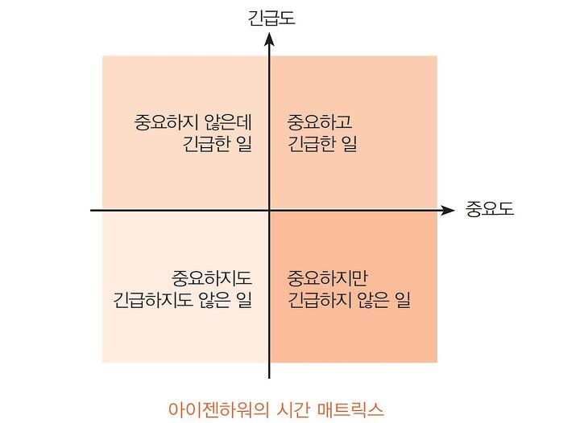

# Chapter 1: 설계와 아키텍쳐란?
- 저수준의 세부사항과 고수준의 구조는 모두 소프트웨어 전체 설계의 구성요소이기 때문에 개별로 존재할 수 없고 이 둘을 구분 짓는 경계가 뚜렷하지 않다
- 소프트웨어 아키텍처를 심각하게 고려할 수 있으려면 좋은 소프트웨어 아키텍처가 무엇인지 이해해야 한다
    - 비용은 최소화하고 생산성은 최대화할 수 있는 설계
    - 아키텍처를 가진 시스템을 만들려면, 이러한 결과로 이끌어줄 시스템 아키텍처가 지닌 속성을 알고 있어야 한다  

 
 

# Chapter: 2 두가지 가치에 대한 이야기
- 모든 소프트웨어 시스템은 이해관계자에게 행위(behavior)와 구조(structure) 두 가지 가치를 제공한다
- 개발자가 둘 중 한가지만 집중하고 나머지 가치를 배제하여 가치에 집중하여 결국 소프트웨어 시스템은 쓸모없게 된다

## 행위
- 소프트웨어의 첫 번째는 요구사항을 기계에 구현하고 버그를 수정하는 일이다.
- 하지만 일이 자신의 직접에 전부라고 생각한다

## 아키텍처
- 소프트웨어를 만든 이유는 기계의 행위를 쉽게 변경할 수 있도록 하기 위해서다.
- 이러한 변경사항을 적용하는 데 드는 어려움은 변경되는 범위(scope)에 비례하며, 변경사항의 형태(shape)와는 관련이 없어야 한다
- 아키텍처가 특정 형태를 다른 형태보다 선호하면 할수록, 새로운 기능을 이 구조에 맞추는 게 더 힘들어지기 때문에 아키턱체는 형태에 독립적이어야 하고, 그럴수록 더 실용적이다

## 더 높은 가치
- `완벽하게 동작하지만 수정이 아예 불가능한 프로그램` VS `동작은 하지만 변경이 쉬운 프로그램`이 있다면 앞으로 쓸 수 있는 프로그램이 더 유용하다
- 만약 추후 업무 관리자의 변경 요청에 변경 비용이 너무 커서 현실적으로 적용할 수 없다라고 대답하면 변경이 불가능할 때까지 시스템을 방치한 프로그래머 잘못이다

## 아이젠하워 매트릭스
- 소프트웨어의 첫 번째 가치인 행위는 긴급하지만 매번 높은 중요도를 가지는 것은 아니다
- 소프트웨어의 두 번째 가치인 아키텍쳐는 중요하지만 즉각적인 긴급성을 필요로 하는 경우는 절대 없다

1. 긴급하고 중요한
2. 긴급하지는 않지만 중요한
3. 긴급하지만 중요하지 않은
4. 긴급하지도 중요하지도 않은
- 아키텍처, 즉 중요한 일은 이 항목의 가장 높은 두 순위를 차지하는 반면, 행위는 첫 번째와 세 번째에 위치하나는 점을 주목하자
- 업무 관리자와 개발자가 흔하게 저지르는 실수는 긴급하지만 중요하지 않은 기능과 진짜 긴급하면서 중요한 기능을 구분하지 못하는 것이다. 이러한 실패로 인해 시스템에서 중요도가 높은 아키텍처를 무시한 채 중요도가 떨어지는 기능을 선택하게 된다
- 따라서 개발자는 기능의 긴급성이 아닌 아키텍처의 중요성을 설득하는 것이 중요하다

## 아키턱쳐를 위해 투쟁하라
- 아키텍처가 후순위가 되면 시스템을 개발하는 비용이 더 많이 들고, 일부 또는 전체 시스템에 변경을 가하는 일이 현실적으로 불가능해진다.
- 이러한 상황이 발생하도록 용납했다면, 이는 결국 소프트웨어 개발팀이 스스로 옳다고 믿는 가치를 위해 충분히 투쟁하지 않았다는 뜻이다.